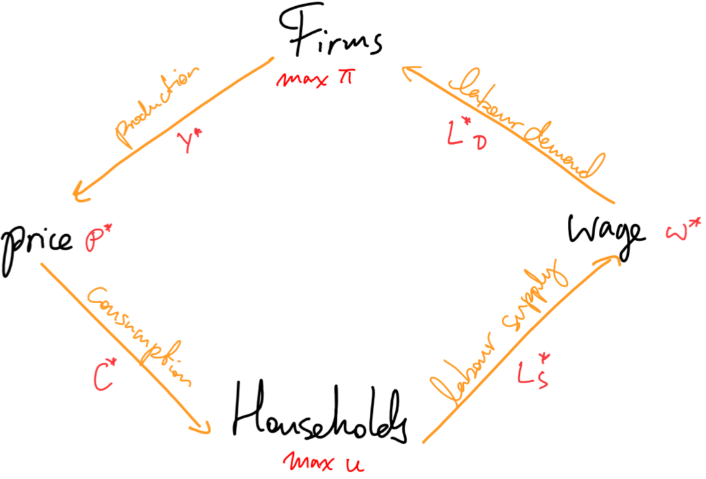
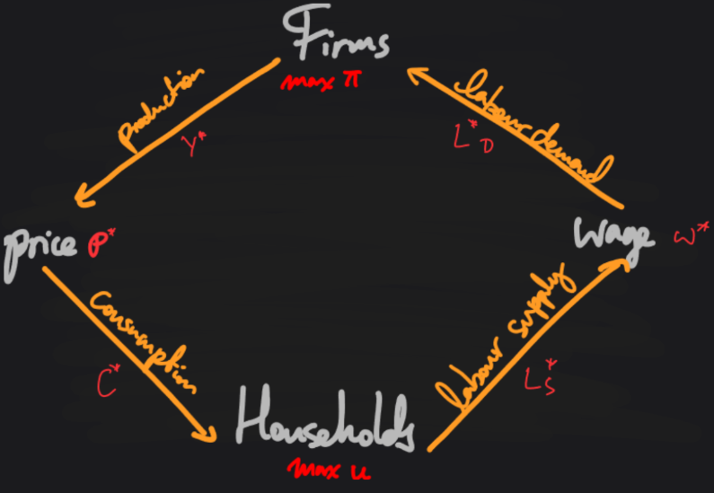

# Burnout

(Explicit content)

I just finished Thomas Vinterberg's *The Celebration* (1998, *Festen* in Danish), the first film in the [Dogme](https://youtu.be/RtsP_dKm9M8?si=2fsqBTOy7zn_kvg5) movement. A Freemason hosts a large gathering at the family hotel for his sixtieth birthday. At the dinner, his son makes a speech about how his father raped him and his dead sister when they were kids.

Now I want a drink.

I haven't had a drink for more than three weeks now. This is the longest time I haven't had a drink in about three years, and probably the only stretch longer than a week.

I don't want to say I've been sober three weeks, because then I'd really sound like an alcoholic. That was the word ("sober," not the other one) the doctor used on the phone call the other day, when I told him I had been burning myself with cigarettes and would like a referral to a psychiatrist.

So instead I went for a walk. I wanted to talk to someone. I thought about messaging the girl I had my first [MFM](https://mfm.urbanup.com/7159166) with after meeting at a [munch](https://en.wikipedia.org/wiki/Munch_(BDSM)) in Amsterdam. We liked each other, she liked another guy also, and we all got along. We went for drinks after. She talked working in consulting, and wanting to fuck the burnout out of her.

"Hey, how are you? How's the burnout?" I thought of writing.

"I know this might be weird, if so please ignore. But I just saw an insane movie, 'Festen' by Thomas Vinterberg. And now I just want to talk to someone."

I thought better than to send it, since it was only getting to 10 AM on a Wednesday in Amsterdam. She probably already had enough to deal with.

I'm dealing with some burnout of my own. Ever since I'd gotten home, I've been anxious to be productive. But sometimes, like now, I also just don't want to work. I can feel it in my body and my mind. And this makes me more anxious, and probably is a manifestation of burnout syndrome. So here I am, blogging.

# Progress

(Safe content)

Anyway, I've been trying to start a research blog (this blog), which I could hopefully use for my PhD applications this winter, about a nine months from now, to explain what I have been doing for a year after I quit my job. So far, I am making slow progress.

My inital plan was to do a short research project on the US-Canadian trade war. So far I've only managed to make some descriptive figures, which I've made into a [blog post](https://qcjx96.github.io/posts/US-CA-trade-war/). The main methodology would be to implement a very simple computable egeneral equilibrium model **(CGE)**, which I think would be quite impressive work for a lowly pre-doc. But CGEs turned out to be quite hard.

What the hell even is a CGE? Luckily, I just explained this to my non-economics friend yesterday. General equilibrium models (the GE in CGE) are basically toy models of the economy represented with equations. You set up equations for households, firms, and optionally, other agents like the government, central bank, and their foreign counterparts. But in simple models, the most important elements are the household and firm agents.

Households make choices for example about how much goods they want to consume, and how much they want to work to pay for those goods. Firms choose how many workers and capital they need to produce final goods for consumers. Then you make markets clear by making supply equal demand, and bada-bing bada-bong, you've solved the equilibrium prices for goods and labour.

## A simple GE model

Let's look at a simple example, just "for fun."

{: .light width="500"}
{: .dark width="500"}

<b>Diagram of our simple model. (I spent way too much time making the light/dark-mode graphic.)</b>

### Firms

Suppose the representative firm uses only labour $$ L $$ to produce goods $$ Y $$ with the production function:
$$
\begin{equation}
    Y = f(L) = A L^\gamma,
    \tag{production}
\end{equation}
$$

where $$ A $$ is a productivity factor and $$ \gamma $$ is a non-zero parameter. The firm maximizes profits
$$
\begin{equation}
    \pi = p Y - w L,
    \tag{profit}
\end{equation}
$$

which is the revenues from production minus the cost of labour. When the profit function is maximized, its first-order derivative is zero:
$$
\begin{align*}
    \frac{\partial \pi}{\partial L} = \gamma A p L^{\gamma-1} - w = 0.
    \tag{FOC}
\end{align*}
$$

Then the firm's labour demand is
$$
\begin{align}
    L_D^* = \left(
        \frac{w}{pA\gamma}
    \right)^{1 - \gamma},
    \tag{labour demand}
\end{align}
$$
which gives optimal production and profits
$$
\begin{align}
    Y^*
    &=
    A
    \left(
            \frac{w}{pA\gamma}
    \right)^{(1 - \gamma)\gamma},
    \tag{goods supply}
    \\
    \pi^*
    &=
    \left[
        p A
        \left(\frac{w}{pA\gamma} \right)^{\gamma}
        -
        w
    \right]
    \left( \frac{w}{pA\gamma} \right)^{1 - \gamma}.
    \tag{profit curve}
\end{align}
$$

### Households

The representative household chooses how much to work $$ L $$ and how much to consume $$ C $$ to maxmize their utility function
$$
\begin{equation}
    u(C, L) = \frac{C^\alpha}{L^\beta},
    \quad
    \alpha, \beta > 0.
    \tag{utility}
\end{equation}
$$

Assume that all profits made by the firm $$ \pi $$ are distributed to the household, though the households cannot directly control the firm's decisions (and therefore profit), so they take $$ \pi $$ as granted.

The household's consumption costs cannot exceed their income from profits and labour, so they are subject to the budget constraint $$ p C \le \pi + w L $$, where $$ p $$ is the price of goods and $$ w $$ is the wage rate.

Since we are in a one-period model, let's assume that the household consumes all their income, so that
$$
\begin{equation}
    p C = \pi + w L.
    \tag{budget constraint}
\end{equation}
$$

Now we solve for optimal consumption demand and labour supply (toggle for details). 

For constrained maximization problems, we set up the <a href="https://en.wikipedia.org/wiki/Lagrange_multiplier">Langrangian function</a>
$$
\begin{equation}
    \mathcal{L} = u(C, L) + \lambda (\pi + w L - p C)
    \tag{Lagrangian}
\end{equation}
$$
and the first-order derivatives with respect to the control variables ($$ C, L $$) and the Lagrange $$ \lambda $$. The first order conditions are
$$
\begin{align}
    \frac{\partial \mathcal{L}}{\partial C}
    &=
    \alpha \frac{C^{\alpha - 1}}{L^\beta} - \lambda p
    = 0,
    \tag{$\mathcal{L}1$}\label{eq:L1}
    \\  
    \frac{\partial \mathcal{L}}{\partial L}
    &=
    -\beta \frac{C^\alpha}{L^{\beta + 1}} + \lambda w
    = 0,
    \tag{$\mathcal{L}2$}\label{eq:L2}
    \\
    \frac{\partial \mathcal{L}}{\partial \lambda}
    &=
    \pi + w L - p C
    = 0.
    \tag{$\mathcal{L}3$}\label{eq:L3}
\end{align}
$$
Then we have from \eqref{eq:L1} and \eqref{eq:L2} that
$$
\begin{align*}
    \lambda
    =
    \frac{\alpha}{p} \frac{C^{\alpha - 1}}{L^\beta}
    =
    \frac{\beta}{w} \frac{C^\alpha}{L^{\beta + 1}}
    \implies
    \frac{L}{C} &= \frac{\beta p}{\alpha w}
    \left(
        =\frac{u_C}{u_L}
    \right)
    \tag{MRS}
\end{align*}
$$
This gives us a formula for the optimal labour-consumption tradeoff:
$$
\begin{align}
    L &= \frac{\beta p}{\alpha w} C.
    \tag{LCT}\label{eq:LCT}
\end{align}
$$

With the budget constraint \eqref{eq:L3} and labour-consumption tradeoff \eqref{eq:LCT}, we have that
$$
\begin{align*}
    \pi + w L - p C
    =
    \pi
    + w \left(
        \frac{\beta p}{\alpha w}
    \right) C - pC
    = 0.
\end{align*}
$$

Then the goods demand curve is
$$
\begin{equation}
    C^* = \frac{\pi}{p}\frac{\alpha}{\alpha-\beta}.
    \tag{goods demand}
\end{equation}
$$
Plugging $$ C^* $$ into \eqref{eq:LCT} gets us the labour supply curve:
$$
\begin{equation}
    L_S^* = \frac{\pi}{w}\frac{\beta}{\alpha-\beta}.
    \tag{labour supply}
\end{equation}
$$

### Market equilibrium

The market clears when demand equals supply for goods and labour:
$$
\begin{equation}
    Y^* = C^*, \quad L_D^* = L_S^*.
    \tag{market clearing}
\end{equation}
$$

We solve for the relative prices of labour and goods (toggle for details).

We have that
$$
\begin{align}
    Y^* = C^*
    \quad\iff\quad
    A
    \left(
            \frac{w}{pA\gamma}
    \right)^{(1 - \gamma)\gamma}
    &=
    \frac{\pi^*}{p}\frac{\alpha}{\alpha-\beta},
    \tag{E1}\label{eq:E1}
    \\
    L_D^* = L_S^*
    \quad\iff\quad
    \left(
        \frac{w}{pA\gamma}
    \right)^{1 - \gamma}
    &=
    \frac{\pi^*}{w}\frac{\beta}{\alpha-\beta}.
    \tag{E2}\label{eq:E2}
\end{align}
$$
Dividing \eqref{eq:E1} by \eqref{eq:E2} gives us
$$
\begin{align*}
    A
    \left(
        \frac{w}{pA\gamma}
    \right)^{\gamma}
    &=
    \frac{w}{p}\frac{\alpha}{\beta}.
\end{align*}
$$

Finally, the relative prices in market equilibrium is then
$$
\begin{align}
    \frac{w^*}{p^*}
    = A \left(
        \frac{\alpha}{\beta}
    \right)^{1-\gamma}.
    \tag{relative price}
\end{align}
$$

This is pretty much the simplest model of a production economy. And it has a nice, neat solution.

# The way forward

These models get pretty hard to solve analytically if you scale up in dimensions (with multiple agents and factor variables). So you use a computer: hence the computable part of **C**GE. From what I gather, there are two main proprietary softwares that people use to do these models, where you basically plug in your equations into an interface from the 90s.

But doing it this way is not interesting to me. Over the past few years, I've developed a sort of disdain for proprietary software (looking at you, Stata). Why? Firstly, you have to invest time to learn how to work the bespoken outdated interface and syntax, which is annoying. Secondly, the documentation and community support (e.g. on StackOverflow) is usually much less robust than for popular open-source programs. Thirdly, because it is not free, I usually have to steal it.

For this project, it would also be incredibly unsatisfying that I would not understand how the model is actually solved.

But I've been going through the CGE literature and found a path forward. First, I will replicate [Zhang (2023)](https://www.pc.gov.au/research/supporting/cge-iterative-method/cge-iterative-method.pdf), a paper that demonstrates how to solve CGE systems iteratively. It uses an example model with trade, and the solution method seems very similar to gradient descent. This gave me the idea to try fitting the demand and supply curves directly using neural networks rather than assuming the utility and production functions. But that's for another time.

Then I will use [Albrecht and Tombe (2016)](https://onlinelibrary.wiley.com/doi/abs/10.1111/caje.12196) as a reference to develop my own model. They model agents for each Canadian province, and includes inter-provincial and foreign trade. This is one of the papers that Mark Carney cited in his [One Canadian Economy](https://markcarney.ca/one-canadian-economy) plan.

More to come.
