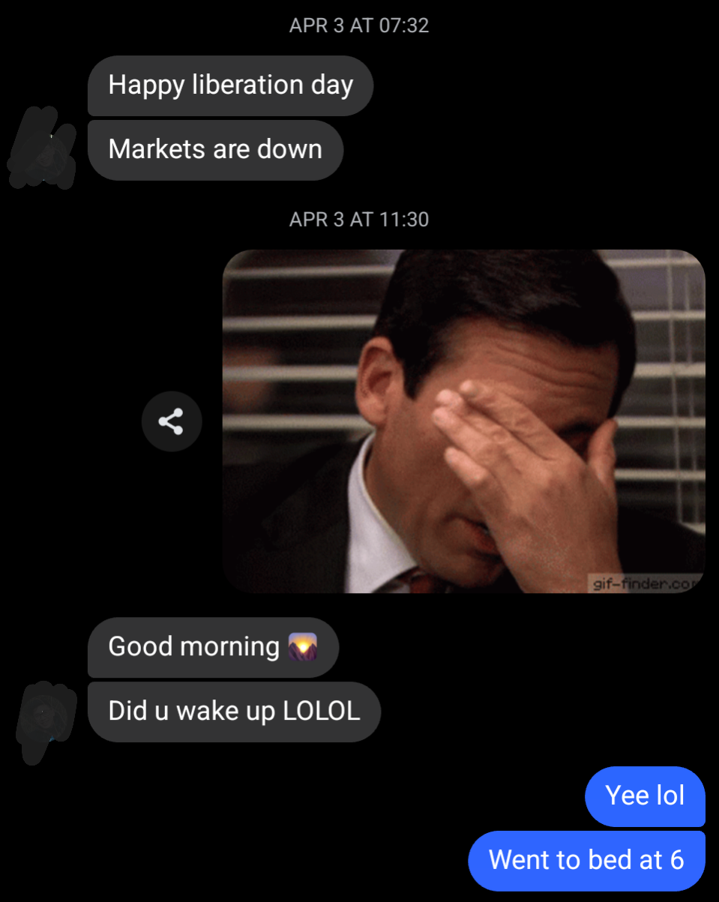
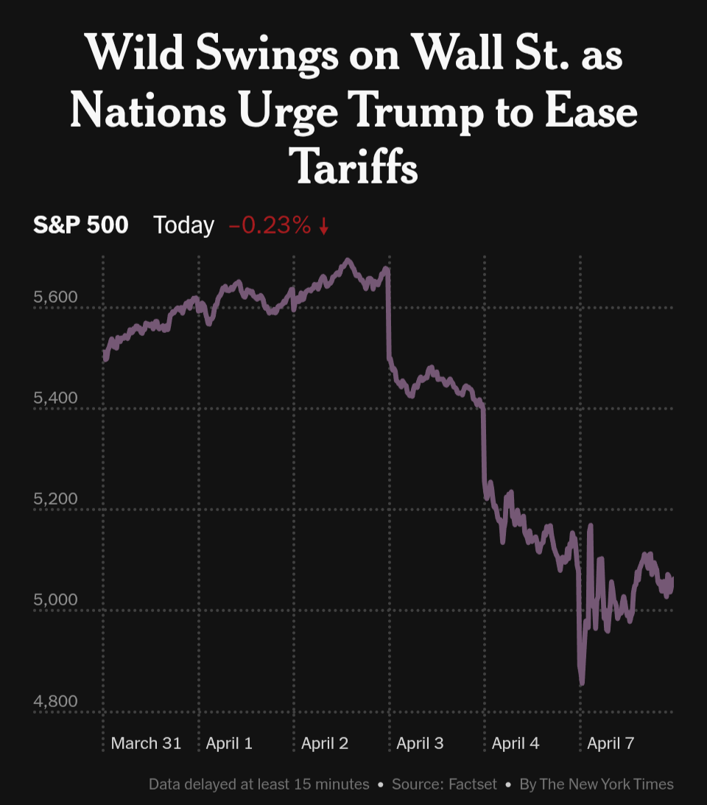

<b>
(work in progress)
</b> 

On Thursday I woke up to a message from my buddy. I checked the NYTimes app, and lo-and-behold, the world was aghast. The news have been filled with headlines about turmoil in markets ever since.

<b>Waking up Thursday</b>

{: width="400"}

<b>Top <a href="https://www.nytimes.com/live/2025/04/07/business/trump-tariffs-stock-market">NYT headline</a> this morning.</b>

{: width="400"}

This got me thinking about why markets move so quickly. When bad news breaks, a sell-off is triggered, prices fall, and the valuation of the stock market falls&mdash;all in the blink of an eye.

Following the "Liberation Day" annoucement, the S&P500 dropped xx% in one day, which translates to a $xx billions valuation loss. But this money is not just gone. (Though some love to use the term "value destruction." It's better for clicks, I guess.) Though global trade will suffer a shock from the tariffs, and there may be production and job losses in result, does the annoucement have any real effects? Though the stock market was spassing out, global trade has not fallen sharply on the exact day of the annoucement.

The question is then: why do stocks spaz out? Well, the financial markets&ndash;in my mind&ndash;are full of Patagonia-vested lemmings, who love to [fall off cliffs together.](https://www.youtube.com/watch?v=YNZ_K14iT-Q)

<b>Lemmings Jonestown</b>

{: width="350"}

Why do lemmings commit mass suicide? Why do they hurtle together to the point of jumping off cliffs? Well first of all, [they don't](https://www.britannica.com/story/do-lemmings-really-commit-mass-suicide). Second, because it's a volume game, and Wall Street runs on fast money. And because there's a lot of money to be made, they compete to undercut each other by slivers. The result is the proverbial scene of "lemmings falling off cliffs." But it's not their fault. It's simply cold hard logic.

## Guess 2/3

To illustrate, take the famouse game theory problem where lemmings try to ["guess two-thirds of the average"](https://en.wikipedia.org/wiki/Guess_2/3_of_the_average). Here's a [video](https://youtu.be/qQ3kFydI_xQ?si=g3JYD4cjU2KsYEAQ&t=2128) of Yale lemmings playing this game.

The Nash equilibrium to this game is, surprisingly, that all lemmings choose zero.

Suppose $ N > 1 $ lemmings, enumerated by $ i $, each guess a number $ x_{i} \in [0, 1] $ from zero to one hundred. Each lemming wins $x_i$ share of the prize if their guess is the closest to $\alpha=\frac{2}{3}$ of the average, 
$$
\begin{equation*}
\bar x = \frac{1}{N} \overset{N}{\underset{i=1}{\sum}} x_i
= \frac{1}{N} (x_1 + x_2 + ... + x_N).
\end{equation*}
$$
The Nash equilibrium result is actually the same for any number $\alpha \in [0, 1)$ between zero and one. But anyway, the goal is to guess as close to the target as possible:
$$
\begin{equation}
    x_i \simeq \alpha \bar x.
\tag{target}
\end{equation}
$$

Obviously, lemming $i$ should not choose $x_i=1$. Because even if all the other lemmings choose the maximum so that $\bar x = 1$, he should guess less because
$$
\begin{equation*}
\alpha < 1 \implies \alpha \bar x < 1.
\end{equation*}
$$

Some lemmings would definitely choose $x_i = 1$ in real life. But let's pretend all the lemmings are smart.

Because the lemmings are smart and know all of this, each should instead choose
$$
\begin{equation*}
x_i \overset{?}{=} \alpha = \frac{2}{3}.
\end{equation*}
$$
Right?

If you said yes, you would not be a smart lemming. Because a smart lemming would remember that all the other lemmings are smart too, and know that they should also choose at most $ x_i \le \frac{2}{3} $. Not $ x_i > \frac{2}{3} $ like a not-smart person. So a smart lemming knows that actually $\bar x \le \alpha$. And therefore, he should actually choose at most
$$
\begin{equation*}
x_i \le \alpha^2 \bar x \le \frac{4}{9}.
\end{equation*}
$$

But... all the other lemmings know this too.

So he should choose at most $ x_i \le \alpha^3 $, right? Yes. But he should then also choose at most $ x_i \le \alpha^4 $, and so on...

By this logic, he needs to infintely undercut the ceiling for the target $\alpha \bar x$. And since everyone else is also undecutting, $\alpha \bar x$ keeps moving down. Thus by this process, you get the Nash equilibrium that all lemmings should choose
$$
\begin{equation*}
x_i^* = \underset{n \to \infty}{\lim}{\alpha}^n \bar X = 0.
\tag{solution}
\end{equation*}
$$
Okay, there are a lot of mixed metaphors in this example. But you get the point, right?* Even perfectly rational behaviour in groups can result in extreme outcomes.

*Don't worry. I'm not sure if I do, either.
